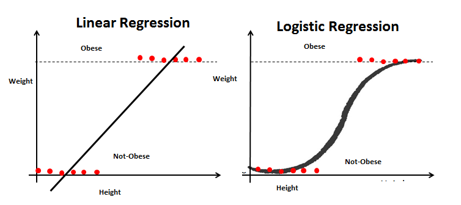
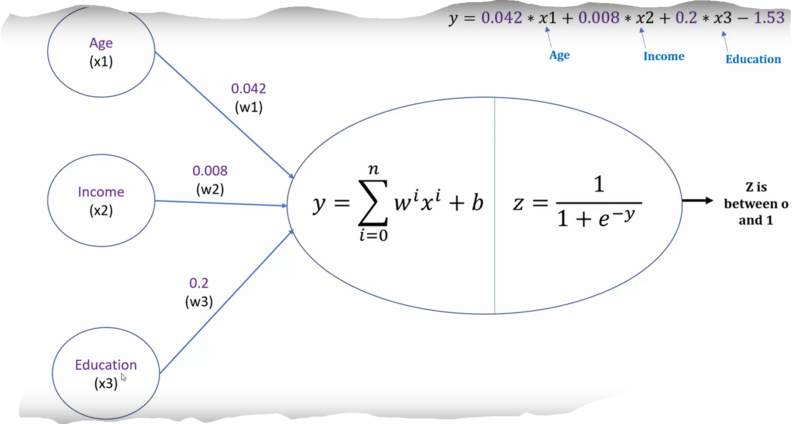

```{r setup, include=FALSE}
knitr::opts_chunk$set(echo = TRUE)
require(reticulate)
```


# Introduction 

The project focuses on using the surveillance camera’s stream to predict possible
target attacks. The images contain objects which can be fed to a supervised 
algorithm to detect deadly objects. Once the objects are detected, the next 
point would be to predict the vector of movement or the personnel itself. 
Is it moving towards a particular target e.g. a school or institution? 
Or is it just police personnel on his duty? 
There is some more research needed to figure out the vector of movement. 
It may be that the person is wanted for a crime. So along with detecting 
objects, faces could be recognized.

# Motivation

Attacks on schools and other institutions have become a new norm in the United 
States where gun violence is quite prevalent. Most of the stories tell us that 
the active shooter was on the school premises and was seen by a few folks but 
failed to take any action on it. Even if the target of the shooting may be 
informed just in time, the chaos might end with taking the wrong action 
e.g., closing a door on the East vs West or asking teachers to lock the classrooms. 

# Data
Some data is already available which can be used for supervised learning
GitHub - ari-dasci/OD-WeaponDetection: Datasets for weapon detection based on image classification and object detection tasks
https://www.researchgate.net/publication/351298349_A_Gun_Detection_Dataset_and_Searching_for_Embedded_Device_Solutions

# Background

Linear regression gives a best fit line, which can't pass through all the data
points. We need a better approach to solve this problem to classify if data belongs
to one of the two categories. 
e.g. from a given set, we want to determine if a person is obese or not. Linear 
regression won't give us a clear answer, but the logistics regression classify 
it much better. 

It uses a Sigmoid function to convert a best fit line to a S-curve line. 

\[sigmoid(z)= \frac{1}{1+e^{-z}}\]

where e is Euler's number \[e = 2.718\]

Convert a value of z to a 0 or 1

```{r Linear_vs_Logistics_regression, fig.cap = "Life expectancy from 1952 - 2007 for Australia. Life expentancy increases steadily except from 1962 to 1969. We can safely say that our life expectancy is higher than it has ever been!"}

##See Figure \@ref(fig:Linear_vs_Logistics_regression))
```




linear regression + sigmoid function = 0/1

value < 0.5 classify 
value > 0.5  classify to other way

## Neuron

Logistics regression can be thought of as representing a single Neuron, which uses 
a linear equation and an activation function (e.g. LED light). So we can represent 
a single Neuron to classify.
e.g. Age (single factor) -> linear equation -> activation function -> value between 0 to 1

\[y = \sum w^i x^i +b\]

# convert to an equation
e.g. Age + Income + Education  -> weighted linear equation -> activation function -> value between 0 to 1

if value > 0.5 then the Neuron is activated otherwise it's not activated



### Neural network

### Training
Backward error propagation is used for training a Nueral network. Basically 
everytime a prediction goes correct or incorrect, the algorithm gives a feedback to the 
network to correct itself. 
If the model was correct, it accentuates otherwise it makes a correction when 
it was incorrect.


```{r, setup}
library(reticulate)
require(openssl)
```

```{python}
x = [1, 2, 3]
```
## Deep learning
